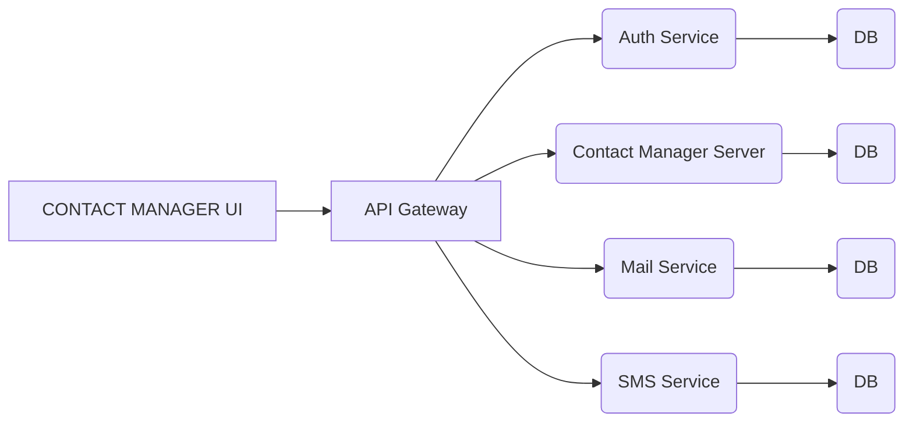

## Contact Mgt App Service
This is the WCI Cambridge Contact Mgt Back End Microservice created to serve the Rest API and 
containing the business logic for supporting the management of client user data, searchable 
and visualizeable from the Contact Manager App UI. It provides secure endpoints 
for accessing the databases in order to change, edit, annotate and curate user data. 
This software runs alongside other components of the Winers Chapel Cambridge Microservices 
system such as the Authentication service, Mail Services, and several others as shown below:

## Service Interactions


- Auth Service - 
- Contact Management App Server - 
- Mail Service - 
- SMS Service - 
- Contact Manager UI -

## Requirements

Before you begin, ensure you have met the following requirements:

- You have a MacOSX/Linux/Windows machine.
- You have Node installed.
- You have Mysql installed and running

## Deploying this service locally
1. Install Node
1. Clone the application from https://github.com/winners-cambridge-tech-hub/contact-mgt-app-server.git
1. Run `npm install` to build your local node_modules
1. Create database in your running Mysql Instance
1. Update your .env file with your database <username>, <password>, and <table-name >
1. This settings wil be automatically picked up by the configuration fil at /config/config.js
1. install sequelize-cli
1. install mysql2
1. To create tables in the database, run migration `sequelize db:migrate`
1. Optional: if you want to load test data, run the command`sequelize db:seed:all`
1. Optional: if you want to delete test data, run the command`sequelize db:seed:undo:all`
1. Run `npm start`  or `node server.js`

### Contributing

Submitting changes to the data follows this workfow:

1. Create a branch with using issue number and brief issue description using [kebab-case](https://medium.com/better-programming/string-case-styles-camel-pascal-snake-and-kebab-case-981407998841), eg. `git checkout -b 'cma-3-create-member-end-point'`
1. Do the work to fix the issue or add a new feature and commit message as appropriate
    - Summarize the change in less than 50 characters
    - Explain the reasons you made this change
    - Make a new bullet for each reason - Each line should be under 72 characters
    - Explain exactly what was done in this commit with more depth than the 50 character subject line. Remember to wrap at 72 characters!
1. Push local changes to the remote feature branch
1. Create a Pull Request to merge the updates in the feature branch into `develop` branch
1. Once the changes are merged into `develop` branch, the Ci/CD plan will automatically deploy these changes to the sandbox development environment where User Acceptance Testing can be done
1. When the UAT is completed successfully, the updates in `develop` can be merged into `master`, either through a Pull Request or using git merge from your local repo


### Contributors

- Check the contribution section [here](https://github.com/winners-cambridge-tech-hub/contact-mgt-app-ui/graphs/contributors)

### Troubleshooting

If something goes wrong, please check the logs.

## Useful Commands

### Project setup
```
npm install
```

### To create or update tables in the database, run migration 
```
sequelize db:migrate
```

### Compiles and hot-reloads for development
```
npm start
```

### Compiles and minifies for production
```
npm build
```

### Code Architecture

This is designed to use the Onion Architecture, an Enterprise layered architecture ...

### Other commands
sequelize seed:generate --name category-seeder


